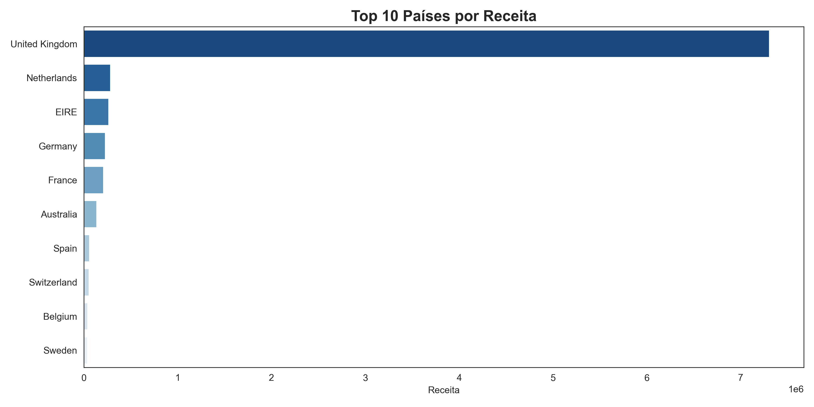
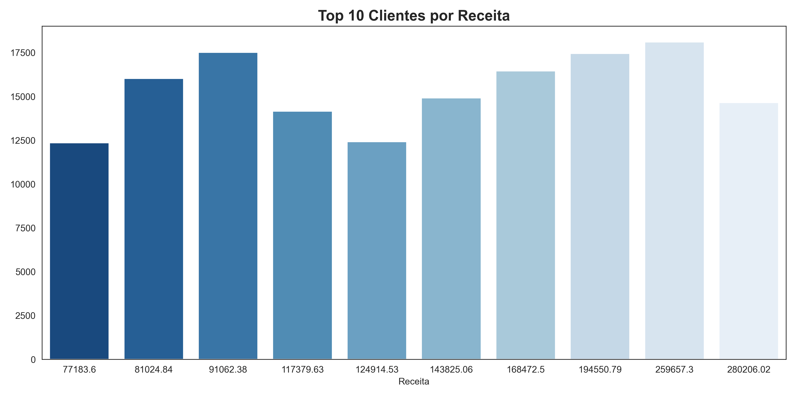
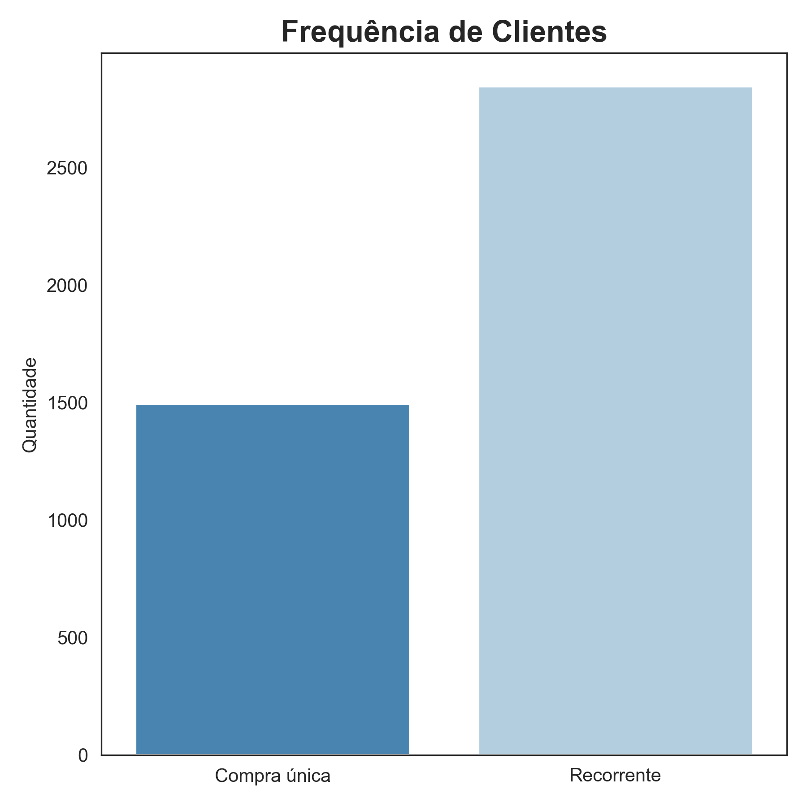

# E-commerce SQL Analysis

## Visão Geral

Este projeto tem como objetivo analisar dados de transações de um e-commerce para identificar padrões de receita, comportamento de clientes e oportunidades de negócio.

A análise foi realizada utilizando SQL para tratamento e exploração dos dados e Python para visualização, com foco em entender como a receita é distribuída entre países e clientes, além de identificar padrões de recorrência.

---

## Dataset

O dataset utilizado contém informações de transações de um e-commerce, incluindo:

- Identificação do pedido (InvoiceNo)
- Código e descrição do produto
- Quantidade comprada
- Data da transação
- Preço unitário
- Identificação do cliente
- País

---

## Estrutura do Projeto

ecommerce-sql-analysis/
│
├── data/
│   └── raw/
│       └── online_retail.csv
│
├── sql/
│   ├── 01_create_clean_table.sql
│   ├── 02_data_quality_checks.sql
│   ├── 03_data_quality_summary.sql
│   ├── 04_create_final_table.sql
│   ├── 05_basic_metrics.sql
│   ├── 06_revenue_by_country.sql
│   ├── 07_top_customers.sql
│   ├── 08_customer_frequency.sql
│   └── 09_customer_value.sql
│
├── scripts/
│   ├── 00_convert_excel_to_csv.py
│   ├── 01_load_csv_to_sqlite.py
│   ├── 02_run_sql_file.py
│   ├── 03_check_table.py
│   ├── 04_run_sql_queries.py
│   ├── 05_create_final_table.py
│   ├── 06_check_final_table.py
│   ├── 07_run_basic_metrics.py
│   ├── 08_run_revenue_by_country.py
│   ├── 09_run_top_customers.py
│   ├── 10_run_customer_frequency.py
│   ├── 11_run_customer_value.py
│   └── 12_visualization.py
│
├── images/
│   ├── revenue_by_country.png
│   ├── top_customers.png
│   └── customer_frequency.png
│
├── notebooks/
│   └── insights.md
│
├── ecommerce.db
└── README.md

---

## Qualidade dos Dados

Antes da análise, foi realizada uma etapa de verificação e limpeza dos dados.

Principais problemas identificados:

- Registros sem identificação de cliente
- Transações com quantidade negativa (cancelamentos)
- Preços inválidos (zero ou negativos)

Após a aplicação das regras de limpeza, a base foi reduzida de 541.909 para 397.884 registros válidos, garantindo maior consistência nas análises.

---

## Métricas Gerais

- Receita total: 8.911.407,90  
- Ticket médio por pedido: 480,87  

O ticket médio indica que os pedidos tendem a envolver múltiplos itens ou compras em maior volume, sugerindo um comportamento mais próximo de atacado do que varejo tradicional.

---

## Receita por País

A análise mostra que a receita está altamente concentrada em um único mercado.

O Reino Unido representa a maior parte do faturamento total, enquanto os demais países possuem participação significativamente menor.

Isso indica uma forte dependência de um único mercado, o que pode representar risco em cenários reais.

---

## Top Clientes

A receita também apresenta concentração em poucos clientes.

Os principais clientes geram valores significativamente superiores à média, indicando a presença de clientes estratégicos para o negócio.

---

## Frequência de Clientes

A maior parte dos clientes realiza mais de uma compra.

A presença de clientes recorrentes indica uma base relativamente engajada, embora ainda exista uma parcela relevante de clientes que realizam apenas uma compra.

---

## Análise de Valor por Cliente

A análise mostra diferentes perfis de clientes de alto valor:

- Clientes com alta frequência e ticket médio menor
- Clientes com poucas compras, mas valores elevados por transação

Isso indica a necessidade de estratégias distintas, como programas de fidelização para clientes recorrentes e relacionamento personalizado para clientes de alto valor.

---

## Tecnologias Utilizadas

- SQL (SQLite)
- Python (pandas, sqlite3)
- Visualização de dados (matplotlib, seaborn)
- VS Code

---

## Conclusão

O projeto demonstra como dados transacionais podem ser transformados em insights relevantes para o negócio.

A análise evidenciou padrões de concentração de receita, comportamento de clientes e oportunidades de retenção, reforçando o papel da análise de dados no suporte à tomada de decisão.